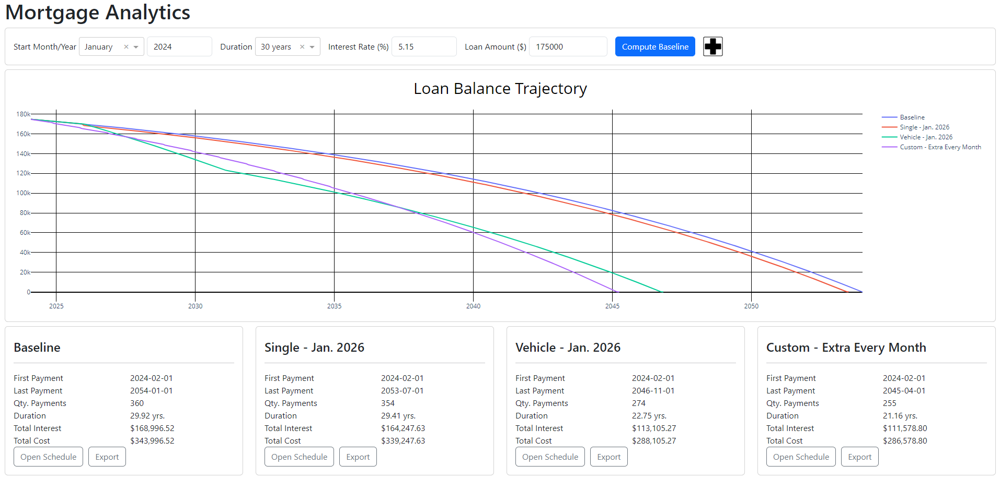

# Mortgage Analytics

The purchase of a home is part of the American Dream and a huge accomplishment for individuals.  It can also be viewed as the largest investment and source of debt for most families.  As far as understanding this debt, many times people are only provided data on their minimum monthly payments in addition to the possible amortization schedule.

This project looks to further this understanding.  Given the inputs of a standard fixed rate mortgage, it allows the user to consider multiple **what-if** scenarios.  Each scenario differing in how extra funds are allocated to the debt as additional principal payments.  These scenarios are then reviewed in terms of total interest cost and life of the loan.  A few example scenarios are listed below.

1. What if I could put down a lump sum of $1,500 in a couple years?
2. What if I kept my current vehicle instead of purchasing a new vehicle and allocated the money to the debt?
3. What if I put down a certain amount every month plus a larger amount every December?

A short video of the dashboard can be accessed [here](ProjectVisuals/DashboardDemo.mp4) and a containerized version of the dashboard can be found at [brockskaggs/mortgage-analytics](https://hub.docker.com/r/brockskaggs/mortgage-analytics) on dockerhub.